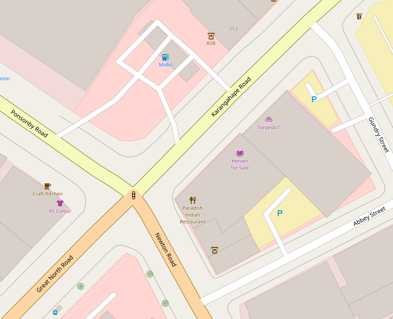

% Govhack 2017 data exploration
% Ashley Noel Hinton
% `r format(Sys.time(), "%d %B %Y")`

```{r setup, include = FALSE}
knitr::opts_chunk$set(cache = TRUE)
```

```{r libraries}
library(knitr)
library(rmarkdown)
library(stringi)
```

The day before Govhack started I was standing in a shop looking out
onto a busy Karangahape Road intersection, talking to the shop owner
about how there were lots of traffic accidents on the
intersection. Mostly they were trying to convince an employee to cross
at the pedestrian crossing rather than shooting between parked
cars. Someone suggested that surely information about how many
accidents happened at that intersection must be online somewhere, and
they searched on Google to find it. They couldn't find it.

This hack attempts to at least answer the question: how many traffic
accidents happen at this intersection?

## Data source

I will use the
[disaggregated crash data](https://www.nzta.govt.nz/safety/safety-resources/road-safety-information-and-tools/disaggregated-crash-data/) 
from NZ Transport Agency (NZTA) to try to answer this question. The data set has
been downloaded and is in this repo as a 62MB CSV file,
[Disaggregated-crash-data.csv](Disaggregated-crash-data.csv).
An accompanying metadata file has also been downloaded from NZTA,
[disaggregated-crash-data-metadata.csv](disaggregated-crash-data-metadata.csv).

### Load crash data

```{r loadData}

## this file is *NOT* in UTF-8. best guess at encoding:
rawData = rawToChar(
    readBin("Disaggregated-crash-data.csv", "raw", 100000))
(encoding = stringi::stri_enc_detect(rawData)[[1]]$Encoding[1])

## read the data using this encoding
crashData = read.csv(file = "Disaggregated-crash-data.csv",
                     fileEncoding = encoding)
summary(crashData)
dim(crashData)

```
Excellent, `r dim(crashData)[1]` rows in `r dim(crashData)[2]` columns
of data. What do the variables represent?

### Load crash metadata

```{r loadMetaData}

## this file is *NOT* in UTF-8. best guess at encoding:
rawMeta = rawToChar(
    readBin("disaggregated-crash-data-metadata.csv", "raw", 100000))
(encoding = stringi::stri_enc_detect(rawMeta)[[1]]$Encoding[1])

## read the data using this encoding
crashMetadata = read.csv(file = "disaggregated-crash-data-metadata.csv",
                         stringsAsFactors = FALSE,
                         fileEncoding = toupper(encoding))
names(crashMetadata)

## what's in columns 3:5?
head(crashMetadata[, 3:5])
## nothing?
all(is.na((crashMetadata)[, 3:5]))
## drop them
crashMetadata = crashMetadata[, 1:2]

```

```{r printMetadata}

## print the table
kable(crashMetadata)

```

Keen spotters will notice that the metadata and the column names have
inconsistent capitalisation of variables, so I'll just make all the
names of my data rows lower case to prevent confusion (maybe).

```{r lowercaseVariables}

names(crashData) = tolower(names(crashData))

```

Useful things I can use:

  + `crash_year` between 2000 and 2017
  
  + `fatal_count`, `seriousinj_count`, `minorinj_count` for counts of
    fatalities, serious injuries, and minor injuries in each crash
	
  + `crash_locn1` and `crash_locn2` should give the street names of
    interest.
	
  + initially `easting` and `northing` looked promising, but these 
    numbers do not seem to correspond to the conversion available at
    <http://www.linz.govt.nz/data/geodetic-system/datums-projections-heights/projections/new-zealand-map-grid-nzmg>.

## The location

The intersection in question is Karangahape and Newton Roads, Newton,
Auckland. The street names I will search for are:

```{r streetNames}

streetNames = toupper(c(
    "Abbey St",         # for some reason street = "ST"
    "Great North Road", # while road = "ROAD"
    "Gundry St",    # go figure
    "Karangahape Road",
    "Newton Road",
    "Ponsonby Road"))

## check street names occure in the data
sapply(X = streetNames, FUN = function(s) { s %in% crashData$crash_locn1 })
sapply(X = streetNames, FUN = function(s) { s %in% crashData$crash_locn2 })

```    

I will take a subset of the data where one of these street names
occurs in both `crash_locn1` and `crash_locn2`.

```{r intersectionData}

intersectionData = crashData[
    crashData$crash_locn1 %in% streetNames
    & crashData$crash_locn2 %in% streetNames, ]

```



